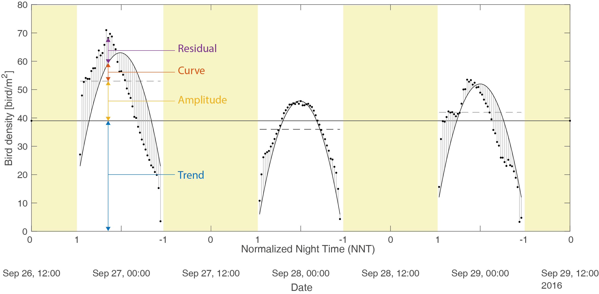

With Bird Migration Modelling (BMM), we are working toward using classical geostatistical method (e.g. kriging) to estimate the european nocturnal migration of bird with weather radar.
## Demo
[
Test the demo](https://zoziologie.raphaelnussbaumer.com/bmm-map/)

## Data
The data used in this study are found on the repository of [European Network for the Radar surveillance of Animal Movement (ENRAM)](http://enram.github.io/data-repository/). See also [vol2bird](https://github.com/adokter/vol2bird) for the processing of the row data.

## Methodolgy

### Density [bird/m2]

The model we proposed is the following,

$$Z{\left(\bf{s},t\right)^p}=t\left(\bf{s}\right)+A\left(\bf{s},t\right)+c\left(t\right)+R\left(\bf{s},t\right)$$

where the power-$$p$$ transform of the bird density $$Z$$ over time $$t$$ and space $$\bf{s}$$ is decomposed into several term:
* $$t\left(\bf{s}\right)$$: a spatialized planar trend.
* $$A\left(\bf{s},t\right)$$: a daily spatialized amplitude.
* $$c\left(\bf{s},t\right)$$: a bell-shape curve explaining the variation during the night, fixed for all nights and all places.
* $$R\left(\bf{s},t\right)$$: a residual term

| Trend  | Amplitude | Curve  | Residual |
| ------------- | ------------- | ------------- | ------------- |
|   |   |   |   |

Modelisation is perform as such
1. Find the optimal power transform of the data which lead to the most gaussian distributed transformed variable using the [Kolmogorov-Smirnov test](https://en.wikipedia.org/wiki/Kolmogorov%E2%80%93Smirnov_test)
2. Fit alltogether the parameters for daily amplitude, plane trend and the curve on the data. The amplitude has a different value for each day of each radars. The trend has 3 variables: the slopes in latitude and longitude and the intercept. Finally, the curve is a polynomial of the sixth degree. 
3. The amplitude is transformed with a normal score and then, a Gneiting covariance model is fitted to the data.
4. Similarly to the amplitude, the residual (data minus model fitted in 2.) is also transform into a Gaussian variable and another Gneiting covariance function is fitted. 

Estimation and simulation are possible by computing each componenent of the model separatly and reassemble them. The two Gaussian process (amplitude and residu) are estimated/simulated using kriging and Sequential Gaussian Simulation. 

Cross-validation is performed for each radar by ignoring the data of this radar for all time and estimating the bird density at the same location and time. This allows to validate the model and its performance.

### Mean Flight Speed [m/s]
Bird flight speed is model with the same framework as the density.

### Mean Flight Direction [deg]
Direction does not present a noctural fluctuation and thus a single variable can be modeled directly. Because of the angular nature of orientation, distance were computed using the closest angle between direction, the model variable was centered around the mean direction (220°) and ordinary kriging was used to correct for the variation in the mean direction.  

## Result

| 					| Density [bird/m2<(sup>] | Mean Flight Speed [m/s]  |Mean Flight Direction [deg] |
| ------------- 	| ------------- 	 | ------------- | ------------- |
|  Model Inference/Cross-validation 	|   [code](https://rafnuss-phd.github.io/BMM/html/Density_modelInf_crossValid) |  [code](https://rafnuss-phd.github.io/BMM/html/FlightSpeed_modelInf_corssValid)  |  [code](https://rafnuss-phd.github.io/BMM/html/FlightDir_modelInf_corssValid)  |
|  Estimation Map 	|   [code](https://rafnuss-phd.github.io/BMM/html/Density_estimationMap) | [code](https://rafnuss-phd.github.io/BMM/html/FlightSpeed_estimationMap)  |  [code](https://rafnuss-phd.github.io/BMM/html/FlightDir_estimationMap)  |
|  Simulation Map 	|   [code](https://rafnuss-phd.github.io/BMM/html/) |  [code](https://rafnuss-phd.github.io/BMM/html/)  |  [code](https://rafnuss-phd.github.io/BMM/html/)  |

**Other**

* [Data exploration MATLAB](https://rafnuss-phd.github.io/BMM/html/Data_Exploration)
* [Simple interpolation](https://rafnuss-phd.github.io/BMM/html/interpolationSimple)

