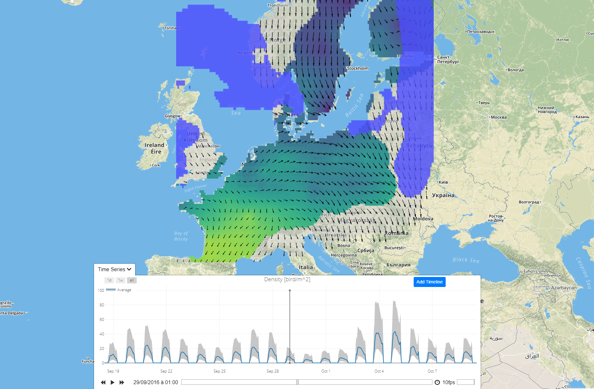
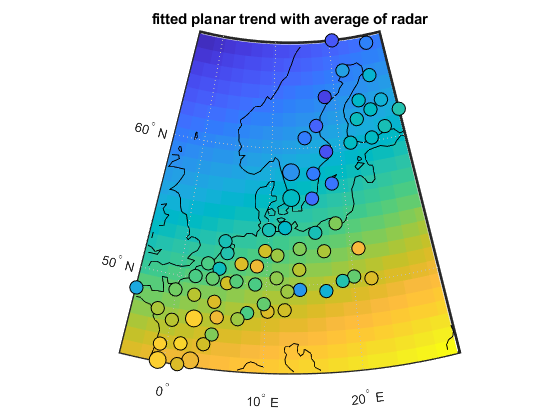
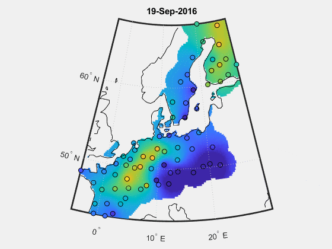
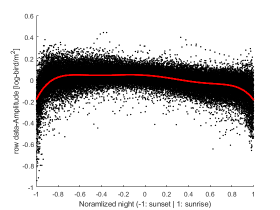

# Bird Migration Map (BMM)

## In short
BMM use classical geostatistical methods (i.e. kriging) to quantify nocturnal bird migration across Europe based on weather radar observations.

## Demo

## Methodolgy

### Bird density [bird/km2]

The proposed model is as follows,

$$Z{\left(\bf{s},t\right)^p}=t\left(\bf{s}\right)+A\left(\bf{s},t\right)+c\left(t\right)+R\left(\bf{s},t\right)$$

where the power-$$p$$ transform of the bird density $$Z$$ over time $$t$$ and space $$\bf{s}$$ is decomposed into 4 components:
* $$t\left(\bf{s}\right)$$: a static spatial planar trend.
* $$A\left(\bf{s},t\right)$$: a daily spatialized amplitude.
* $$c\left(\bf{s},t\right)$$: a bell-shape curve explaining the variation during the night, fixed for all nights and all places.
* $$R\left(\bf{s},t\right)$$: a residual term accounting for sub-daily fluctuations.

| Trend  | Amplitude | Curve  | Residual |
| ------------- | ------------- | ------------- | ------------- |
|   |   |   |   |

Modelisation is perform as such
1. Find the optimal power transform of the data which lead to the most gaussian distributed transformed variable using the [Kolmogorov-Smirnov test](https://en.wikipedia.org/wiki/Kolmogorov%E2%80%93Smirnov_test)
2. Fit alltogether the parameters for daily amplitude, plane trend and the curve on the data. The amplitude has a different value for each day of each radars. The trend has 3 variables: the slopes in latitude and longitude and the intercept. Finally, the curve is a polynomial of the sixth degree. 
3. The amplitude is transformed with a normal score and then, a Gneiting covariance model is fitted to the data.
4. Similarly to the amplitude, the residual (data minus model fitted in 2.) is also transform into a Gaussian variable and another Gneiting covariance function is fitted. 

Estimation and simulation are possible by computing each componenent of the model separatly and reassemble them. The two Gaussian process (amplitude and residu) are estimated/simulated using Kriging. 

Validation is performed by (1) Cross-validation for each radar by ignoring the data of this radar for all time and estimating the bird density at the same location and time and (2) comparaison to Birdscan radars.

code: [MATLAB LiveScript](https://rafnuss-postdoc.github.io/BMM/2016/html/Density_inference_cross_validation.html)

### Flight Speed and Direction [m/s]
Bird flight (speed and direction) is modeled by its two componants (south-north and east-west). The resulting vectoriel field can be assumed stationary and thus, does not requires the same complex decomposition as bird density, but only a transformation ([LambertW](https://arxiv.org/abs/1010.2265)). As the cross-covariance was relatively small (~2x smaller than each covariance) and because both componants are always known, the kriging was done separatly for each one.   

## Data
- The raw data used in this study are found on the repository of [European Network for the Radar surveillance of Animal Movement (ENRAM)](http://enram.github.io/data-repository/) and were generated with [vol2bird](https://github.com/adokter/vol2bird).
- These data were cleaned manually into vertical profile of reflectivity. These data are available on zenodo 
- The final interpolated spatio-temporal map can also be downloaded from zenodo .

## Result
[Check the online visualization](https://bmm.raphaelnussbaumer.com/).

| 					| Density [bird/m2] | Flight |
| ------------- 	| ------------- 	 | ------------- |
|  Estimation Map 	|    |   |
| Simulation Map    |   |  |

## Read more

I'll be updating [the projet on reasearchgate](https://www.researchgate.net/project/Bird-Migration-Modelling-BMM) with conference presentations and articles.

